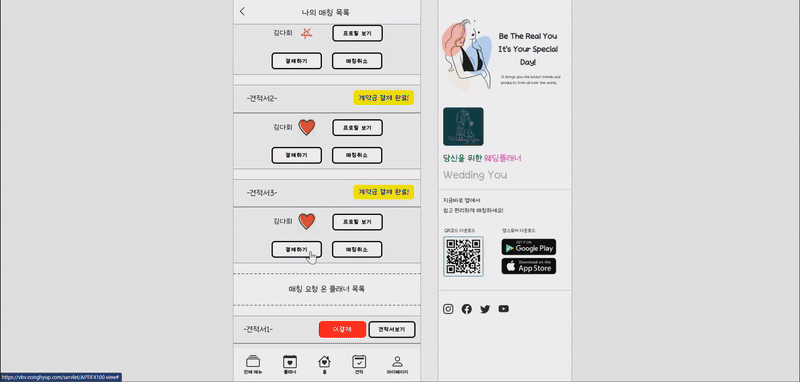

#  WeddingYou – Smart Wedding Planning App 💍📅

**WeddingYou** is an elegant and intuitive wedding planning application that streamlines every step of the wedding journey – from guest management to vendor scheduling. Built with **Spring Boot**, **React**, and **MySQL & PostgreSQL**, the platform leverages modern DevOps and cloud technologies like **Docker**, **Fly.io**, **Railway**, and **Netlify**, along with **Amazon S3** for media storage and **SMTP** for email communication. It also integrates **PortOne (Iamport)** for reliable and flexible payment processing. The app features robust JPA entity relationships and a responsive front-end enhanced with optimistic UI updates.

---

## 🚀 Tech Stack

-   **Frontend:** React, Axios
-   **Backend:** Spring Boot
-   **Database:** MySQL (Railway) => PostgreSQL (Fly)
-   **Authentication:** Role-based (User/Admin)
-   **Deployment:** Docker, Docker-Compose, Netlify, Fly.io

---

## 🌟 Key Features

-   **📝 Pre-Quote Based Matching System**: Clients initiate the process by submitting their ideal wedding plan and budget as a pre-written quote. Planners then review and match with clients whose needs align with their services, ensuring a tailored and efficient experience.
-   **🤝 Planner-Client Matching**: A matching system connects clients with planners through a mutual like/swipe system, making collaboration intuitive and personal.
-   **💳 PortOne (Iamport) Payment Integration**
    -   Seamless and secure payment process for services or reservations.
    -   Real-time payment result handling and confirmation.
-   **📬 SMTP Email Notifications**: Password reset workflows.
-   **📷 AWS S3 Image Uploads**: Upload and store user profile images, wedding photos, and vendor logos securely.
-   **⚙️ Spring Data JPA Relationships**:Extensive use of OneToMany, ManyToOne, and ManyToMany associations.
-   **⚡ Optimistic UI in React**: Instant UI updates for smoother UX during guest list edits, RSVP responses, etc.
-   **🌐 Dockerized Full Stack**: Unified Dockerfile and docker-compose setup for frontend-backend orchestration.
-   **📡 Deployed with Netlify & Fly.io**: Frontend on Netlify, Backend on Fly.io.
-   **📱 Responsive UI**: Optimized for various devices and screen sizes.

---

## 🔐 Security Measures

-   **🛡️ Backend Validation**: DTO-level and entity-level validation with Spring annotations.
-   **🔐 CORS & Token Handling**: Proper configuration for cross-origin requests.

---

## 🏗️ Architecture

-   **Domain-Driven Design**: Entity relationships represent real-world wedding components.
-   **Spring Boot REST API**: Modular and RESTful service structure.
-   **React Component-Based Architecture**: Clean and maintainable frontend components.

---

## 🚀 Live Demo

👉 [Meet your perfect wedding planner](https://weddingyou-dahee-kim.netlify.app/)

---

## 🖼 Preview

---
